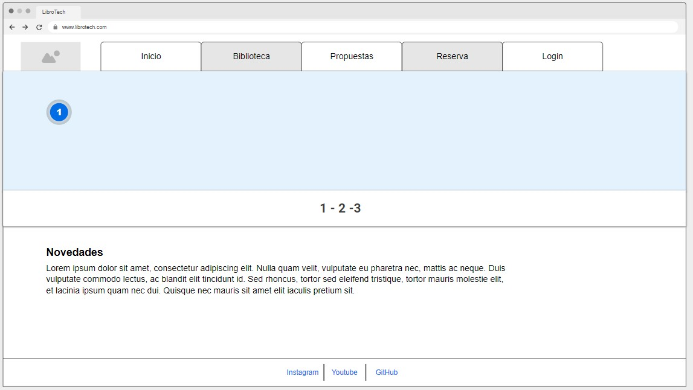
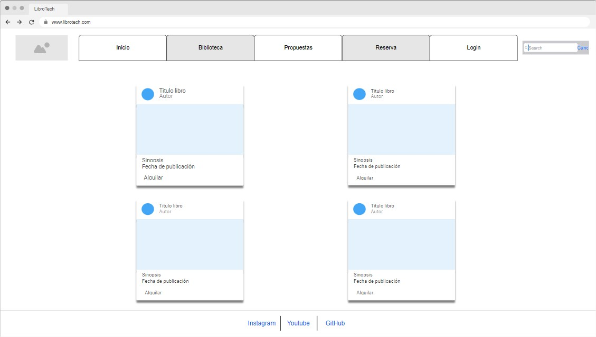
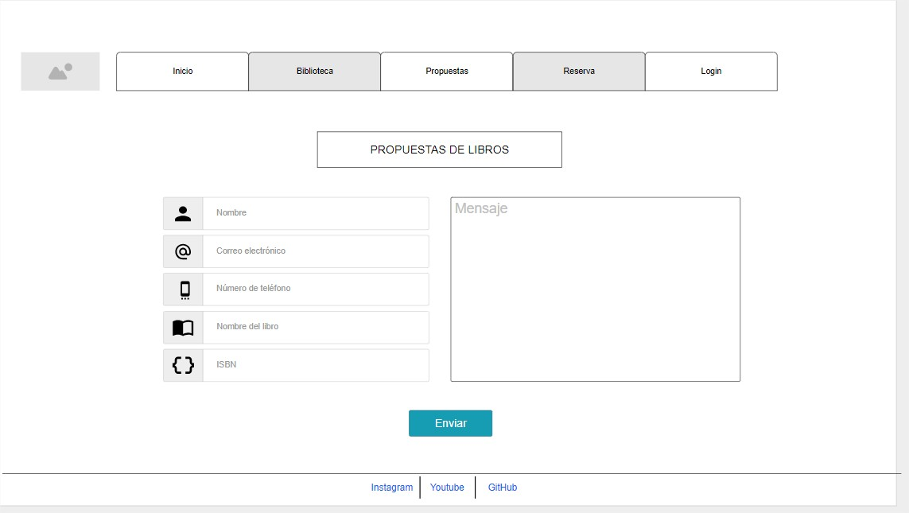
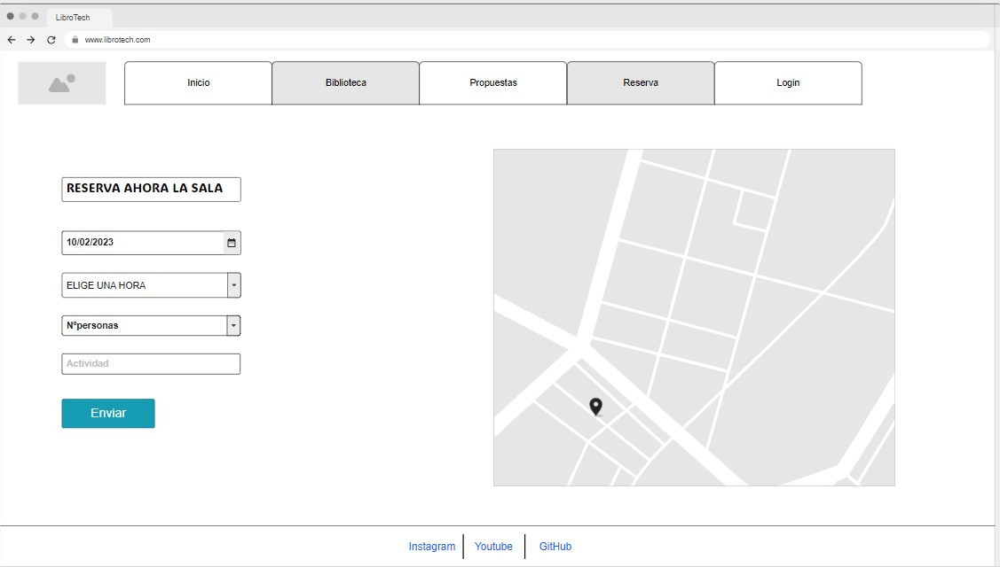
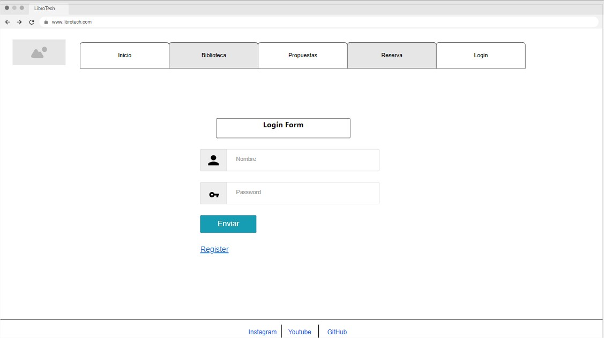
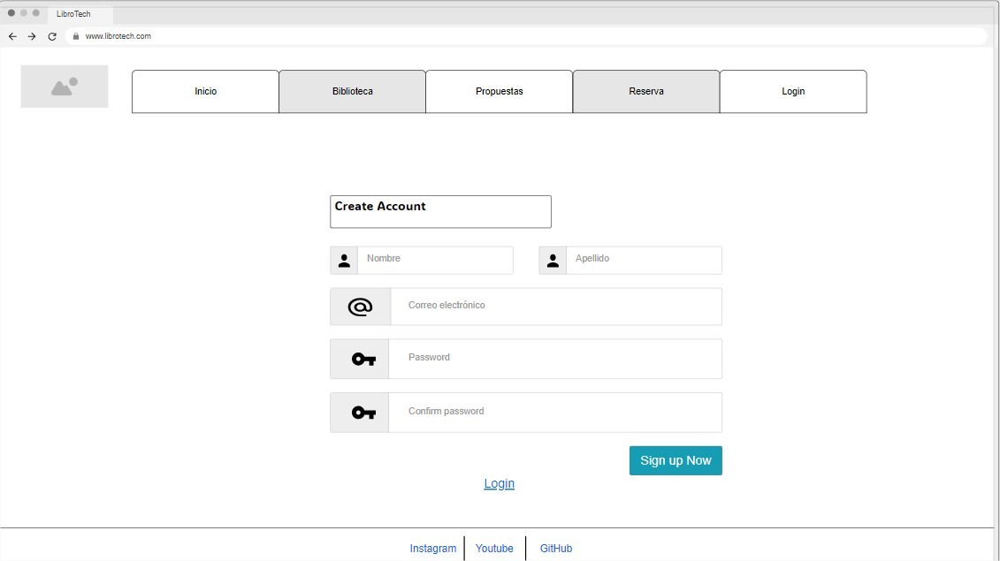

# LibroTech

# Página web
https://soyadnane.github.io/librotech/

## Descripción del Proyecto

Este proyecto tiene como objetivo reformar la biblioteca de Cuatrovientos a convertirla en una biblioteca digital accesible a través de una página web. Ya que se han hecho reformas en el centro y ahora la biblioteca se ha convertido en una sala común. La idea principal es escanear todos los libros físicos existentes en la biblioteca y luego ponerlos a disposición del público en general para su alquiler gratuito. Esto permitirá que un público más amplio acceda a la colección de libros y, al mismo tiempo, conservará los libros físicos en su estado original.

**Creación de una Página Web:**
   - Diseño y desarrollo de una página web interactiva y amigable para el usuario.
   - Creación de una base de datos para almacenar la información de los libros digitalizados.

## Funcionalidad de cada página

1. **Inicio:**
   - En esta página se sube todas las novedades que hay 

3. **Página Biblioteca:**
   - Implementación de un sistema de alquiler gratuito de libros para usuarios registrados.
   - Podras alquilarlo durante un periodo específico.
   - Organización de los archivos digitales por título y autor para facilitar la gestión.
   - Implementación de un sistema de búsqueda que permita a los usuarios encontrar libros por título y autor

4. **Página Reserva:**
   - Posibilidad de rellenar un formulario para reservar una sala.
   - Se puede hacer uso de la sala para cualquier actividad, ya que esta insonorizada y cuenta con equipamiento variado.
   - Normas: No destruir nada.

5. **Página Login/Register**
    - Información de login se guardaran en una base de datos.
    - Nos reservamos el derecho de gestionar/administrar tus datos.

## Guia de estilos
1. **Fuentes:**
Hemos utilizado dos fuente. Una para los titulos y otra para el texto.
- Fuente para titulos:

- Fuente para texto:

2. **Colores:**
Los colores juegan un papel fundamental en el diseño de una página web, ya que pueden transmitir emociones, establecer la identidad de la marca y afectar la experiencia del usuario. Aquí tienes una pequeña descripción de por qué se han elegido los colores "d49a6d," "1785e4," y "eeddd2" en su página web:

"d49a6d" (Marrón claro): Este tono de marrón claro aporta una sensación de calidez y comodidad. El marrón a menudo se asocia con la tierra y la naturaleza, lo que puede evocar sensaciones de estabilidad y confianza.

"1785e4" (Azul brillante): El azul es un color que generalmente se asocia con la confianza, la seguridad y la profesionalidad. El tono brillante de azul que han elegido puede transmitir una sensación de frescura y modernidad. Además, el azul se relaciona con el cielo y el mar, lo que puede inspirar tranquilidad y confianza en los usuarios.

"eeddd2" (Beige claro): El beige claro es un color neutral y suave que crea un fondo acogedor y relajante en una página web. Este color puede sugerir simplicidad, limpieza y una sensación de calma. El uso de un tono beige claro en combinación con los otros colores y ayuda a equilibrar la paleta de colores, haciendo que la página sea fácil de leer y navegar.

Imagen de los colores respectivamente:

Hemos elegido estos colores porque son los que más relacionamos con un ambiente de lectura y la tranquilidad. 

## Esquema de las páginas web
- Inicio: En la página de inicio, se presenta un carrusel que exhibe las imágenes principales de nuestra web, con una transición automática cada 5 segundos. También se proporciona la opción de iniciar sesión o registrarse, en caso de no estar registrado. Más abajo, se pueden visualizar las últimas novedades que hemos incorporado a nuestra página, como nuevos apartados o libros agregados en las últimas tres semanas.

- Biblioteca: En la sección de la biblioteca, se muestran los libros disponibles para alquilar, junto con toda la información relevante sobre cada libro, acompañada de una pequeña imagen ilustrativa.

- Propuestas: La página de propuestas almacena las solicitudes de aquellos que desean proponer o añadir un libro a nuestra biblioteca. Para ello, se solicitan ciertos datos para facilitar el posterior contacto.

- Reservas: En esta sección, puedes reservar la nueva sala de la biblioteca para llevar a cabo actividades que cumplan con las normas de convivencia del centro educativo.

- Login: Inicias sesión.

- Register: Regístrate en caso de no disponer de una cuenta.

## Tecnologías Utilizadas

- **Lenguajes:** HTML, CSS, JQuery y BootStrap

## Contribución

Si deseas contribuir a este proyecto, ¡estamos abiertos a colaboraciones!
- **Envía un correo:** contact@librotech.com

## Autores
- [@haghmir](https://www.github.com/haghmir)
- [@soyadnane](https://www.github.com/soyadnane)
