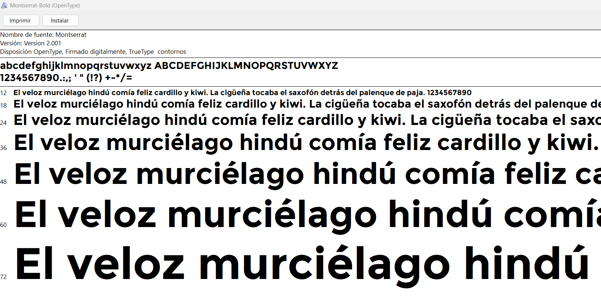

# LibroTech

## Descripción del Proyecto

Este proyecto tiene como objetivo reformar la biblioteca de Cuatrovientos a convertirla en una biblioteca digital accesible a través de una página web. Ya que se han hecho reformas en el centro y ahora la biblioteca se ha convertido en una sala común. La idea principal es escanear todos los libros físicos existentes en la biblioteca y luego ponerlos a disposición del público en general para su alquiler gratuito. Esto permitirá que un público más amplio acceda a la colección de libros y, al mismo tiempo, conservará los libros físicos en su estado original.

**Creación de una Página Web:**
   - Diseño y desarrollo de una página web interactiva y amigable para el usuario.
   - Creación de una base de datos para almacenar la información de los libros digitalizados.

## Funcionalidad de cada página

1. **Inicio:**
   - En esta página se sube todas las novedades que se vayan implementando a nuestra web. Tanto si hacemos cambios en nuestras politicas de privacidad, como si añadimos algún libro u hacemos alguna colaboración con alguna editorial. También anunciaremos algunos eventos que hagamos.

3. **Página Biblioteca:**
   - Implementación de un sistema de alquiler gratuito de libros para usuarios registrados.
   - Podras alquilarlo durante un periodo específico.
   - Organización de los archivos digitales por título y autor para facilitar la gestión.
   - Implementación de un sistema de búsqueda que permita a los usuarios encontrar libros por título y autor

4. **Página Reserva:**
   - Posibilidad de rellenar un formulario para reservar una sala.
   - Se puede hacer uso de la sala para cualquier actividad, ya que esta insonorizada y cuenta con equipamiento variado.
   - Normas: No destruir nada.

5. **Página Login/Register**
    - Información de login se guardaran en una base de datos.
    - Nos reservamos el derecho de gestionar/administrar tus datos.

## Guia de estilos
1. **Fuentes:**
Hemos utilizado dos fuente. Una para los titulos y otra para el texto.
- Fuente para titulos:

- Fuente para texto:

2. **Colores:**
Estos son los tres colores principales que hemos seleccionado y cambiado:

Colores en código: "d49a6d","1785e4","eeddd2".

Imagen de los colores respectivamente:

## Tecnologías Utilizadas

- **Lenguajes:** HTML, CSS, JQuery y BootStrap

## Contribución

Si deseas contribuir a este proyecto, ¡estamos abiertos a colaboraciones!
- **Envía un correo:** contact@librotech.com

## Autores
- [@haghmir](https://www.github.com/haghmir)
- [@soyadnane](https://www.github.com/soyadnane)